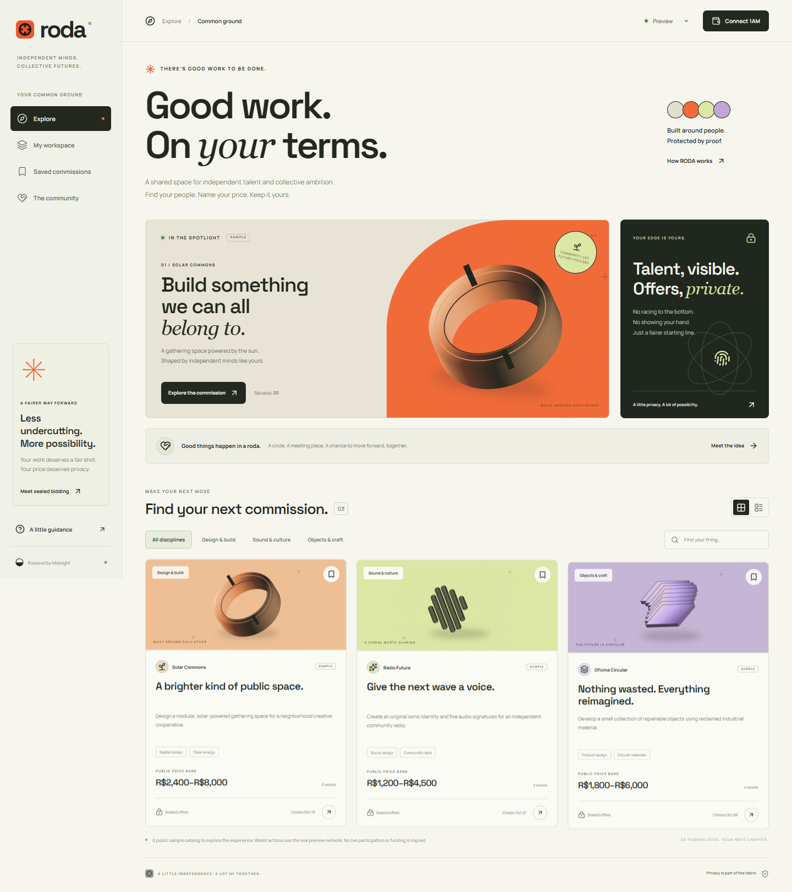
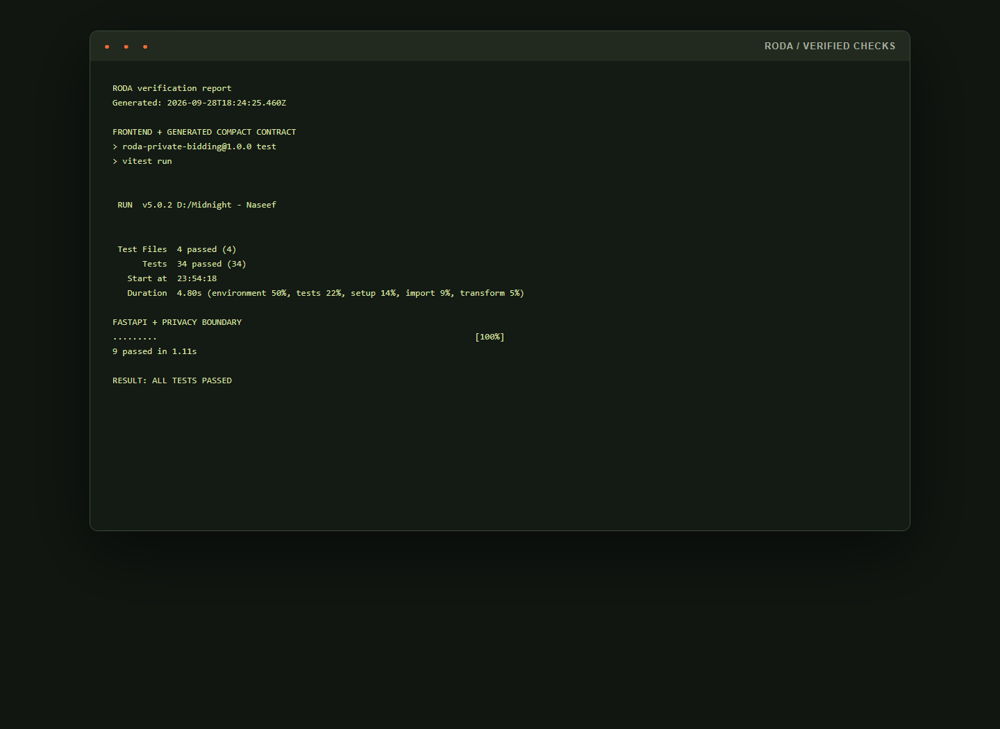

# RODA

**Good work. On your terms.** RODA is a private bidding room for independent workers and community commissions. A bidder prepares an offer in an encrypted local vault, connects 1AM, deploys a personal worker contract from the browser, and receives the real finalized contract address and deployment transaction hash. The same contract can seal, withdraw, or voluntarily open the committed offer.

The visual language is Brazilian Afrofuturist neo-industrial: circular public infrastructure, sun-baked metal, dark mineral surfaces, sharp signal orange, optimistic lime, and an editorial rhythm built around the bidder’s agency. It avoids flags, costumes, folklore motifs, and generic neon crypto gradients.



## Product boundary

The included catalog contains three clearly marked sample commissions. It demonstrates real Midnight Preview/Preprod wallet and contract flows without claiming live participation, funding, escrow, automatic winner selection, or payment settlement.

| Public | Private |
| --- | --- |
| Room ID, price band, deadline | Exact sealed offer |
| Worker contract and finalized transaction metadata | Worker secret and blinding salt |
| Salted commitment and per-contract replay tag | Vault passphrase and proposal material |
| Voluntarily opened amount | Any unopened or withdrawn amount |

Read the full [privacy model](docs/PRIVACY_MODEL.md) and [architecture](docs/ARCHITECTURE.md).

## Stack

- React 19, TypeScript, Vite, Framer Motion
- Midnight.js 4.1.1, DApp Connector API 4.0.1, Compact runtime 0.16.0
- Compact compiler 0.31.1 with generated ZKIR/prover/verifier artifacts
- FastAPI, SQLAlchemy async, Alembic, Pydantic, Google GenAI SDK
- Neon Postgres in production, SQLite for local development
- Netlify frontend and Render backend configuration
- Node.js 22 and Python 3.11+

Versions follow the current [Midnight compatibility matrix](https://docs.midnight.network/relnotes/support-matrix). Preview and Preprod use the same compiled toolchain. The browser takes indexer and node configuration from the connected wallet.

## Project structure

```text
contracts/                Compact source, compiler output, artifact manifest
public/contract/          Browser-served ZKIR, proving and verifier keys
src/                      React UI, wallet, vault and Midnight integration
backend/app/              FastAPI service and public-only schemas
backend/migrations/       Alembic database schema
tests/                    Wallet, vault, UI and compiled-contract tests
backend/tests/            API, redaction, fallback and aggregation tests
tools/blender_scene.py    Reproducible Blender scene for the ring sculpture
docs/                     Proposal, privacy model, architecture, demo script
```

## Local frontend

Prerequisites: Node.js 22, Chrome, and the 1AM wallet extension.

```bash
npm ci
copy .env.example .env.local
npm run dev
```

`VITE_API_URL` may be left blank. The app then uses deterministic local brief guidance and keeps finalized receipts only on the device. Set it to the Render API origin to enable Gemini-backed public guidance and optional public receipt reporting.

## Local backend

```bash
cd backend
uv sync --frozen
copy .env.example .env
uv run alembic upgrade head
uv run uvicorn app.main:app --reload --port 8000
```

The local default is SQLite. API docs are available at `http://localhost:8000/docs` in development and disabled in production.

## Compact toolchain

Midnight supports Compact compilation on Linux and macOS; Windows developers should use WSL.

```bash
curl --proto '=https' --tlsv1.2 -LsSf \
  https://github.com/midnightntwrk/compact/releases/download/compact-v0.5.2/compact-installer.sh | sh
compact update 0.31.1
compact compile --version
npm run contract:build
npm run contract:verify
```

Run the compiler install and `compact update` inside your default WSL2 Linux distribution. From Windows, `npm run contract:build` invokes that WSL2 distribution, compiles with the pinned 0.31.1 toolchain, copies the generated ZKIR and proving/verifier keys into `public/contract`, and refreshes the artifact manifest. `npm run contract:verify` hashes the source and generated artifacts, then checks the browser copies. Do not use a newer unpinned compiler unless the target-network compatibility matrix changes.

## Wallet and real browser deployment

1. Install 1AM and select Preview or Preprod in RODA. RODA only offers connector API v4 providers identified as 1AM; other injected wallet providers are ignored.
2. Fund the selected test wallet with tNIGHT and register it for DUST generation.
3. Open a sample commission, set an in-band offer, and save the encrypted local vault.
4. Export the private backup. Keep it and the passphrase safe.
5. Review the disclosure boundary and the wallet-prover trust note.
6. Click **Deploy my worker contract** and approve in 1AM.
7. RODA waits for indexer finalization, then stores and displays the returned contract address and deployment transaction hash.
8. Click **Prove & seal my offer** to call the real `seal` circuit.

No success UI or receipt is created before Midnight.js returns finalized transaction data. If submission becomes uncertain, RODA retains the transaction ID and requires recovery before another write.

## Proof server

RODA delegates proof generation through `ConnectedAPI.getProvingProvider`, so it uses the proving environment configured in 1AM. A prover can observe private witness material. Configure the wallet to use a local or trusted prover.

The supplied Docker Compose file runs the version from the compatibility matrix:

```bash
docker compose -f docker-compose.proof.yml up -d
```

It listens on port 6300. The image downloads public proving parameters on first startup. Point 1AM at the local server according to its current settings. See Midnight’s [proof server guide](https://docs.midnight.network/guides/run-proof-server).

## Gemini boundary

Set `GEMINI_ENABLED=true` and `GEMINI_API_KEY` on Render. The endpoint accepts only a known public room ID and one of three preset questions. It never accepts free text, a wallet address, bid data, a secret, a document, or a credential. Output is schema-validated; failure or timeout returns a deterministic local answer. Only a SHA-256 hash of the normalized public prompt is stored.

## Neon setup

Use branch-first Neon development:

1. Create or select a Neon project and keep its default branch as production.
2. Create a child branch such as `development` for local integration and migration checks.
3. Use the pooled hostname containing `-pooler` for `DATABASE_URL`.
4. Use the direct hostname without `-pooler` for `DATABASE_DIRECT_URL`.
5. Run `uv run alembic upgrade head` against development before applying it to production.

The database stores only public receipts, verification labels, and hashes of normalized public Gemini requests. It has no columns for bids, secrets, addresses belonging to wallets, credentials, documents, or raw prompt text.

## Tests and verification

```bash
npm run contract:verify
npm run lint
npm test
npm run build
cd backend
uv run ruff check .
uv run pytest
```

Frontend and contract tests exercise wallet discovery, 1AM preference, network switching, stale sessions, encrypted storage, wrong-password and tamper rejection, backup scoping, amount rotation, real generated contract circuits, range enforcement, deadline enforcement, nullifiers, withdrawal, selective opening, sample labels, filters and responsive UI behavior. Backend tests cover health, redaction, deterministic Gemini fallback, public-only schemas, receipt conflicts, aggregation and hash-only auditing.



## Deploy to Netlify and Render

GitHub Actions runs the frontend/Compact and FastAPI checks on pushes and pull requests. Render waits for passing GitHub checks before deploying. Netlify deploys from its connected GitHub branch.

### Render

Create a Blueprint from `render.yaml`; the API is set to Render's Free plan and auto-deploys from the linked branch. Free web services sleep after 15 minutes without traffic and can take about a minute to wake. The free service has an ephemeral filesystem, so use Neon/Postgres rather than SQLite for deployed data. The Blueprint runs Alembic at startup because Render pre-deploy commands require a paid service. Add these secret or site-specific variables:

- `DATABASE_URL`: pooled Neon URL
- `DATABASE_DIRECT_URL`: direct Neon URL
- `CORS_ORIGINS`: exact Netlify HTTPS origin
- `GEMINI_ENABLED=true` and `GEMINI_API_KEY` in the Render dashboard only if you want to enable Gemini guidance

The service runs Alembic before starting Uvicorn. `AUTO_CREATE_TABLES=false` is enforced in production.

### Netlify

Create a site from this folder using `netlify.toml`. Set `VITE_API_URL` to the Render origin, then deploy. The generated proving artifacts are served with immutable caching. Add the final Netlify domain to `CORS_ORIGINS` before enabling the site.

There is no live demo URL in this folder because no deployment was performed and no URL is invented.

## Known limitations

- The nullifier prevents replay in one worker contract. It does not enforce one human or wallet across separate contracts.
- Client-reported receipts are never counted as verified. An indexer verification worker is a future addition.
- Losing both the local data/backup and its passphrase makes the private state unrecoverable.
- The app is configured for Preview and Preprod, not Mainnet.
- Real browser deployment requires a compatible connected 1AM provider, test funds/DUST, and its configured prover.
- The Blender MCP was unavailable in the build environment. The deterministic Blender scene script is included but its `.blend` and rendered PNG were not generated.

## Product documents

- [Product proposal](docs/PRODUCT_PROPOSAL.md)
- [Privacy model](docs/PRIVACY_MODEL.md)
- [Architecture](docs/ARCHITECTURE.md)
- [One-minute demo script](docs/DEMO_SCRIPT.md)

No repository was initialized, no commits were created, and no author metadata is included.
