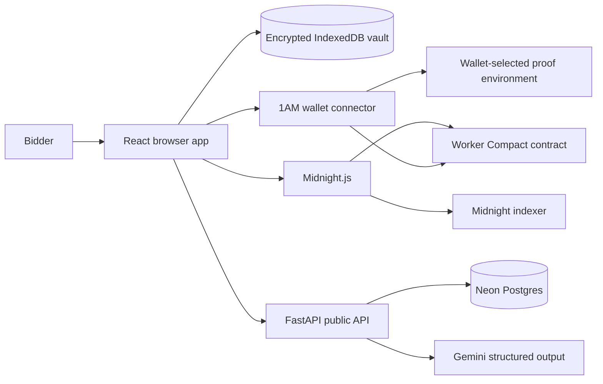

# Architecture

The browser downloads committed ZKIR, prover, and verifier artifacts from `/contract`. `deployContract` constructs the worker contract locally, the wallet balances and approves the transaction, and the public-data provider waits for indexer finalization. RODA saves the actual returned contract address and deployment transaction hash under a scope made from network, wallet fingerprint, and room ID.

The API is deliberately outside the contract transaction path. The dApp continues with local deterministic guidance when Render or Gemini is unavailable. Receipt sharing is optional and cannot promote a record to `indexer_verified`.

## Deployment topology

- Netlify serves the Vite app and immutable generated contract artifacts.
- Render serves FastAPI and runs Alembic as a pre-deploy command.
- Neon’s pooled connection is used by API traffic; the direct connection is used by migrations.
- Preview and Preprod endpoints come from the connected wallet configuration, preventing endpoint drift between the wallet and dApp.
